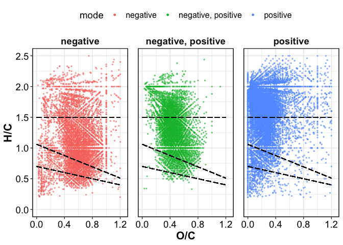
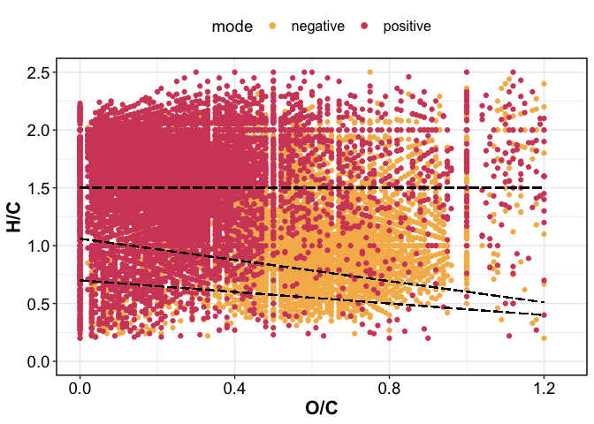
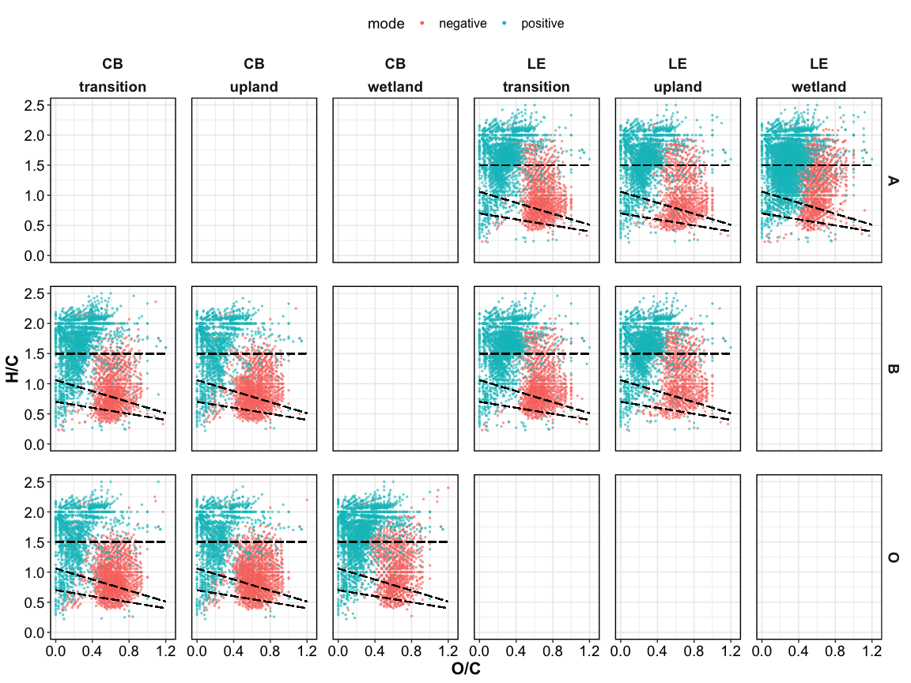
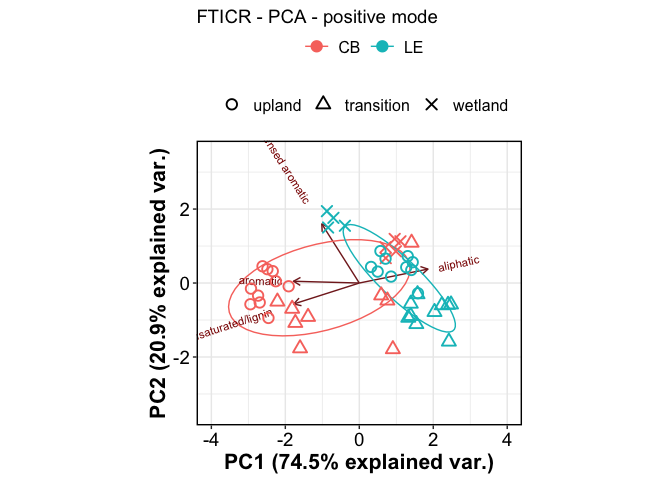
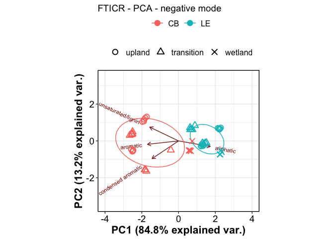
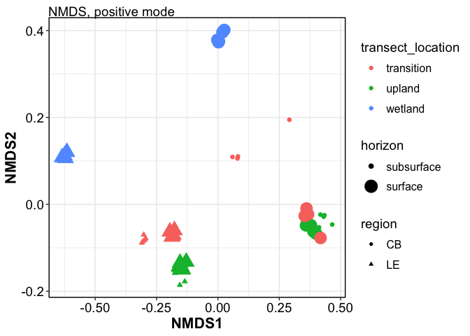
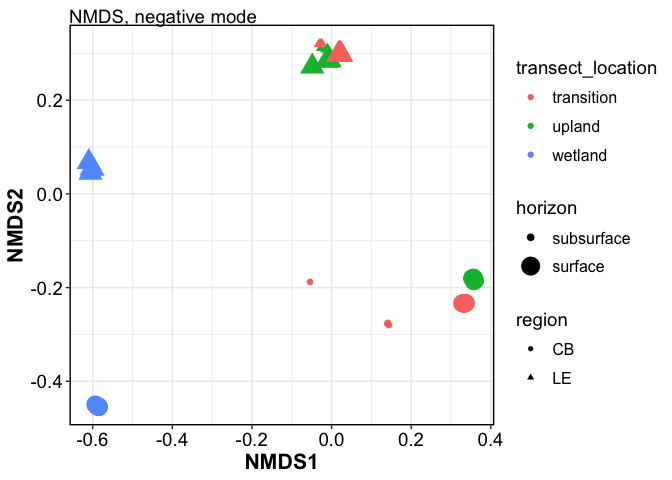
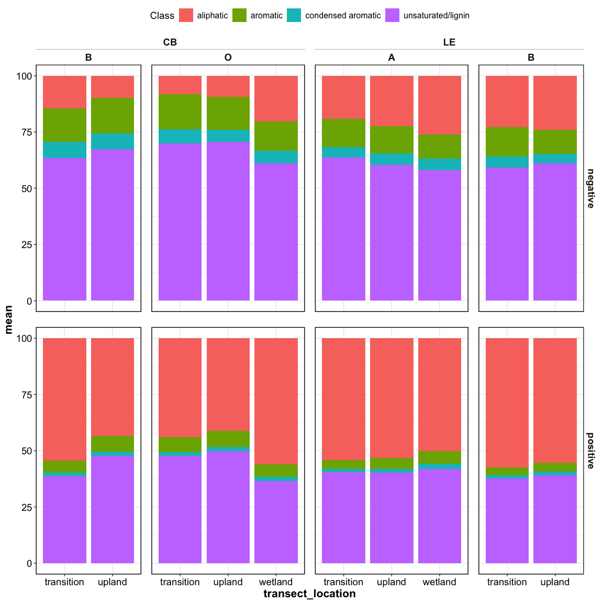

## FTICR-MS

### VAN KREVELEN

Unique peak assignments for + vs. - mode
<!-- --><!-- -->

<!-- -->

------------------------------------------------------------------------

### PERMANOVA

|                   |  Df |  SumOfSqs |        R2 |          F | Pr(\>F) |
|:------------------|----:|----------:|----------:|-----------:|--------:|
| mode              |   1 | 2.6604864 | 0.8794898 | 2259.36464 |   0.001 |
| region            |   1 | 0.0896189 | 0.0296258 |   76.10708 |   0.001 |
| transect_location |   2 | 0.0739490 | 0.0244457 |   31.39987 |   0.001 |
| horizon           |   2 | 0.0298575 | 0.0098701 |   12.67794 |   0.001 |
| Residual          |  89 | 0.1048008 | 0.0346445 |         NA |      NA |
| Total             |  95 | 3.0250340 | 1.0000000 |         NA |      NA |

PERMANOVA across all FTICR data showed that mode (positive vs. negative)
accounted for 88% of overall variability/separation.

So we split the data by mode for all subsequent analyses.

|                   |  Df |  SumOfSqs |        R2 |         F | Pr(\>F) |
|:------------------|----:|----------:|----------:|----------:|--------:|
| region            |   1 | 0.0628111 | 0.3144840 | 144.51811 |   0.001 |
| transect_location |   2 | 0.0501636 | 0.2511601 |  57.70911 |   0.001 |
| horizon           |   2 | 0.0133861 | 0.0670219 |  15.39964 |   0.001 |
| Residual          |  42 | 0.0182542 | 0.0913957 |        NA |      NA |
| Total             |  47 | 0.1997275 | 1.0000000 |        NA |      NA |

For negative mode, region accounted for 31 % and transect 25 % of total
variability.

|                   |  Df |  SumOfSqs |        R2 |        F | Pr(\>F) |
|:------------------|----:|----------:|----------:|---------:|--------:|
| region            |   1 | 0.0298027 | 0.1808196 | 20.70815 |   0.001 |
| transect_location |   2 | 0.0381819 | 0.2316581 | 13.26518 |   0.001 |
| horizon           |   2 | 0.0196958 | 0.1194985 |  6.84271 |   0.003 |
| Residual          |  42 | 0.0604455 | 0.3667361 |       NA |      NA |
| Total             |  47 | 0.1648201 | 1.0000000 |       NA |      NA |

For positive mode, region accounted for 18 % and transect 23 % of total
variability.

### PCA

<!-- --><!-- -->

### NMDS

clustering and NMDS for NEGATIVE MODE

<!-- -->

    ## <Guides[1] ggproto object>
    ## 
    ## fill : <GuideLegend>

<!-- -->

    ## <Guides[1] ggproto object>
    ## 
    ## fill : <GuideLegend>

### RELATIVE ABUNDANCE

<!-- -->

------------------------------------------------------------------------

## Session Info

Session Info

Date run: 2026-02-20

    ## R version 4.5.0 (2025-04-11)
    ## Platform: aarch64-apple-darwin20
    ## Running under: macOS Sequoia 15.7.3
    ## 
    ## Matrix products: default
    ## BLAS:   /Library/Frameworks/R.framework/Versions/4.5-arm64/Resources/lib/libRblas.0.dylib 
    ## LAPACK: /Library/Frameworks/R.framework/Versions/4.5-arm64/Resources/lib/libRlapack.dylib;  LAPACK version 3.12.1
    ## 
    ## locale:
    ## [1] en_US.UTF-8/en_US.UTF-8/en_US.UTF-8/C/en_US.UTF-8/en_US.UTF-8
    ## 
    ## time zone: America/Los_Angeles
    ## tzcode source: internal
    ## 
    ## attached base packages:
    ## [1] stats     graphics  grDevices utils     datasets  methods   base     
    ## 
    ## other attached packages:
    ##  [1] ggh4x_0.3.1         factoextra_1.0.7    cluster_2.1.8.1    
    ##  [4] ggConvexHull_0.1.0  PNWColors_0.1.0     ggbiplot_0.55      
    ##  [7] googlesheets4_1.1.1 vegan_2.7-1         permute_0.9-7      
    ## [10] nmrrr_1.0.0         lubridate_1.9.4     forcats_1.0.0      
    ## [13] stringr_1.5.1       dplyr_1.1.4         purrr_1.0.4        
    ## [16] readr_2.1.5         tidyr_1.3.1         tibble_3.3.0       
    ## [19] ggplot2_4.0.2       tidyverse_2.0.0     tarchetypes_0.13.1 
    ## [22] targets_1.11.3     
    ## 
    ## loaded via a namespace (and not attached):
    ##  [1] tidyselect_1.2.1   Exact_3.3          rootSolve_1.8.2.4  farver_2.1.2      
    ##  [5] S7_0.2.0           fastmap_1.2.0      janitor_2.2.1      digest_0.6.37     
    ##  [9] base64url_1.4      timechange_0.3.0   lifecycle_1.0.4    secretbase_1.0.5  
    ## [13] processx_3.8.6     lmom_3.2           magrittr_2.0.3     compiler_4.5.0    
    ## [17] rlang_1.1.6        tools_4.5.0        igraph_2.1.4       yaml_2.3.10       
    ## [21] data.table_1.17.0  ggsignif_0.6.4     knitr_1.50         labeling_0.4.3    
    ## [25] prettyunits_1.2.0  plyr_1.8.9         RColorBrewer_1.1-3 abind_1.4-8       
    ## [29] expm_1.0-0         withr_3.0.2        grid_4.5.0         googledrive_2.1.1 
    ## [33] ggpubr_0.6.0       e1071_1.7-16       scales_1.4.0       MASS_7.3-65       
    ## [37] cli_3.6.5          mvtnorm_1.3-3      rmarkdown_2.29     generics_0.1.3    
    ## [41] rstudioapi_0.17.1  httr_1.4.7         tzdb_0.5.0         readxl_1.4.5      
    ## [45] gld_2.6.7          proxy_0.4-27       splines_4.5.0      parallel_4.5.0    
    ## [49] cellranger_1.1.0   vctrs_0.6.5        boot_1.3-31        Matrix_1.7-3      
    ## [53] carData_3.0-5      car_3.1-3          whistledown_0.1.0  callr_3.7.6       
    ## [57] hms_1.1.3          rstatix_0.7.2      ggrepel_0.9.6      Formula_1.2-5     
    ## [61] glue_1.8.0         codetools_0.2-20   ps_1.9.1           cowplot_1.1.3     
    ## [65] stringi_1.8.7      gtable_0.3.6       pillar_1.10.2      htmltools_0.5.8.1 
    ## [69] R6_2.6.1           evaluate_1.0.3     lattice_0.22-6     haven_2.5.4       
    ## [73] backports_1.5.0    broom_1.0.8        snakecase_0.11.1   gargle_1.5.2      
    ## [77] class_7.3-23       DescTools_0.99.60  Rcpp_1.1.1         nlme_3.1-168      
    ## [81] mgcv_1.9-1         xfun_0.53          fs_1.6.6           pkgconfig_2.0.3

