## FTICR-MS

### VAN KREVELEN

Unique peak assignments for + vs. - mode
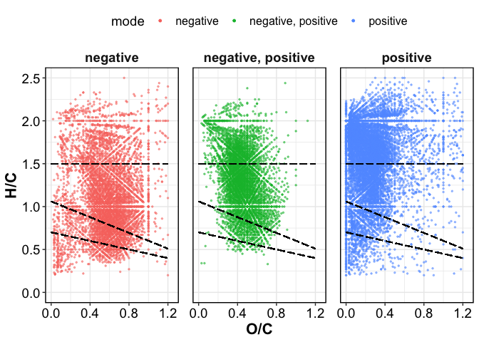<!-- -->

    ## [1] "unique + vs - mode"

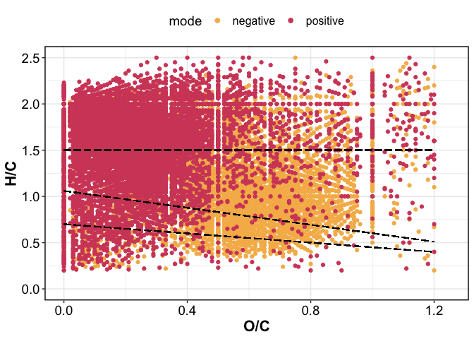<!-- -->

All identified peaks across the different samples

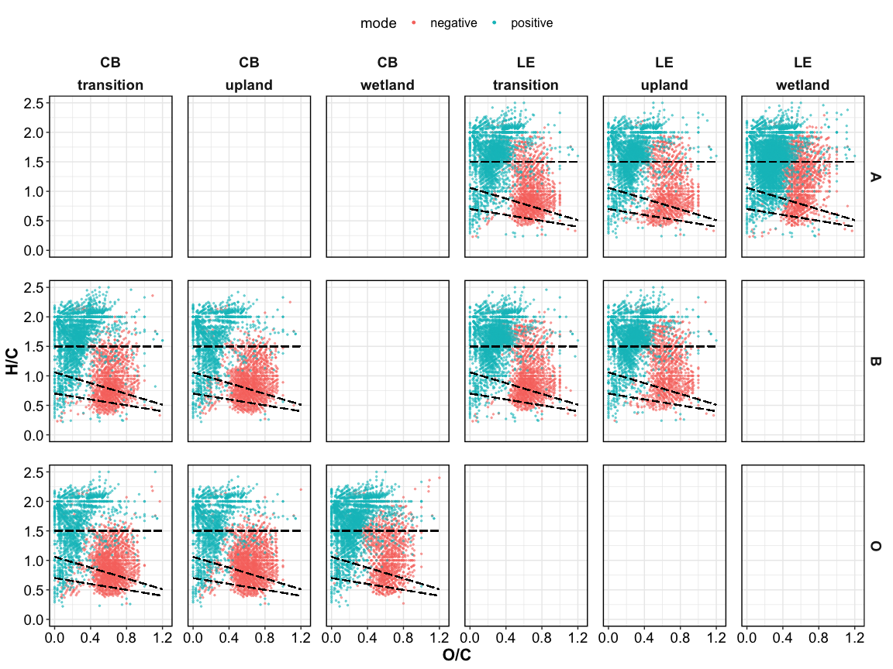<!-- -->

### PERMANOVA

|                   |  Df |  SumOfSqs |        R2 |          F | Pr(\>F) |
|:------------------|----:|----------:|----------:|-----------:|--------:|
| mode              |   1 | 2.6604864 | 0.8794898 | 2226.81444 |   0.001 |
| region            |   1 | 0.1812737 | 0.0599245 |  151.72520 |   0.001 |
| transect_location |   2 | 0.0748534 | 0.0247447 |   31.32598 |   0.001 |
| horizon           |   1 | 0.0271308 | 0.0089688 |   22.70837 |   0.001 |
| Residual          |  90 | 0.1075275 | 0.0355459 |         NA |      NA |
| Total             |  95 | 3.0250340 | 1.0000000 |         NA |      NA |

PERMANOVA across all FTICR data showed that mode (positive vs. negative)
accounted for 88% of overall variability/separation.

So we split the data by mode for all subsequent analyses.

|                   |  Df |  SumOfSqs |        R2 |         F | Pr(\>F) |
|:------------------|----:|----------:|----------:|----------:|--------:|
| region            |   1 | 0.1324966 | 0.6633868 | 274.16636 |   0.001 |
| transect_location |   2 | 0.0504319 | 0.2525036 |  52.17769 |   0.001 |
| horizon           |   1 | 0.0108597 | 0.0543726 |  22.47128 |   0.001 |
| Residual          |  43 | 0.0207806 | 0.1040450 |        NA |      NA |
| Total             |  47 | 0.1997275 | 1.0000000 |        NA |      NA |

For negative mode, region accounted for 66 % and transect 25 % of total
variability.

|                   |  Df |  SumOfSqs |        R2 |        F | Pr(\>F) |
|:------------------|----:|----------:|----------:|---------:|--------:|
| region            |   1 | 0.0571189 | 0.3465530 | 39.78097 |   0.001 |
| transect_location |   2 | 0.0387458 | 0.2350797 | 13.49245 |   0.001 |
| horizon           |   1 | 0.0184003 | 0.1116389 | 12.81508 |   0.001 |
| Residual          |  43 | 0.0617409 | 0.3745957 |       NA |      NA |
| Total             |  47 | 0.1648201 | 1.0000000 |       NA |      NA |

For positive mode, region accounted for 34 % and transect 23 % of total
variability.

### PCA

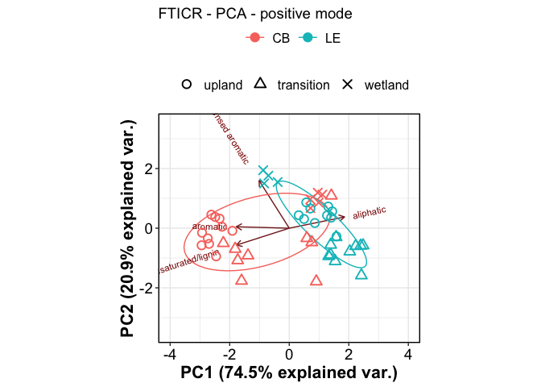<!-- -->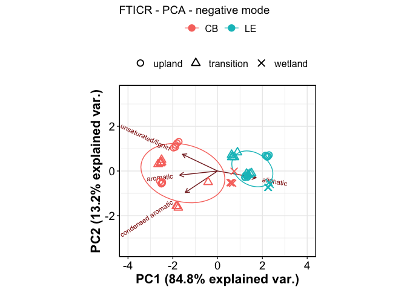<!-- -->

### NMDS

clustering and NMDS for NEGATIVE MODE

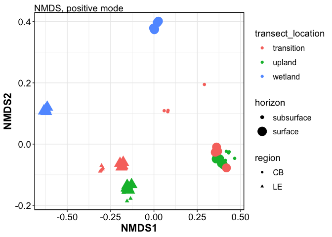<!-- -->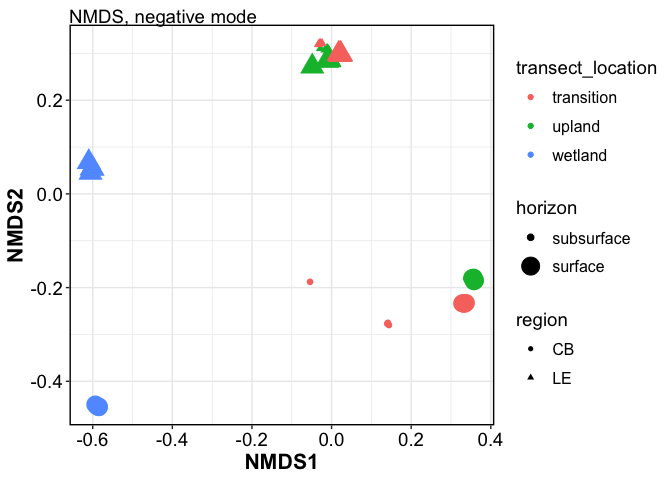<!-- -->

### RELATIVE ABUNDANCE

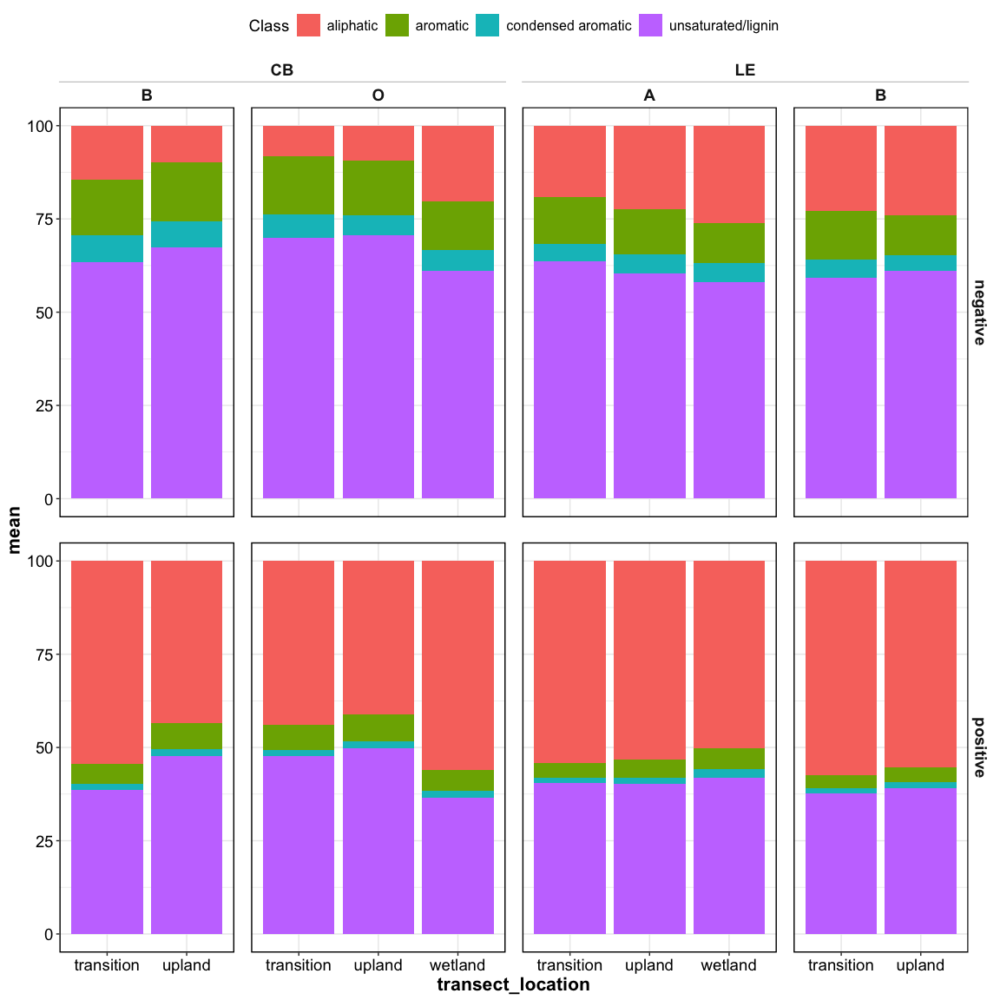<!-- -->

------------------------------------------------------------------------

## NMR

We did NMR on (a) water extracts and (b) SPExtracts

### Example NMR spectra

One example spectrum per transect location

    ## [1] "WATER EXTRACTS"

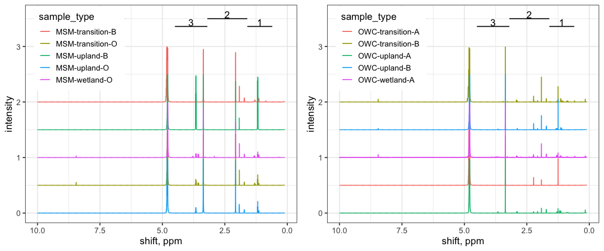<!-- -->

    ## [1] "SPE EXTRACTS"

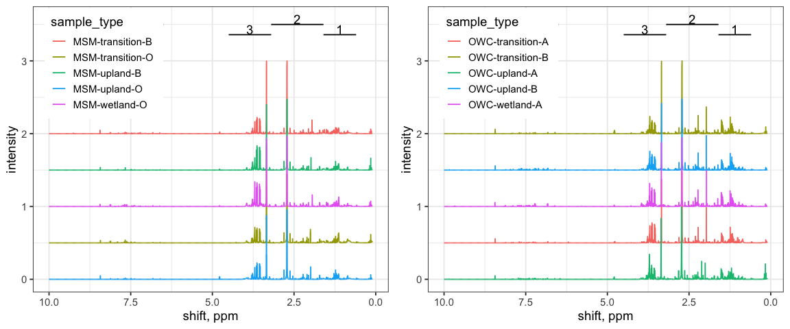<!-- -->

### PERMANOVA

|                   |  Df |  SumOfSqs |        R2 |          F | Pr(\>F) |
|:------------------|----:|----------:|----------:|-----------:|--------:|
| extraction        |   1 | 1.9789114 | 0.6932902 | 172.826234 |   0.001 |
| site              |   1 | 0.2483364 | 0.0870020 |  21.688213 |   0.001 |
| transect_location |   2 | 0.0686294 | 0.0240436 |   2.996841 |   0.032 |
| Residual          |  45 | 0.5152633 | 0.1805169 |         NA |      NA |
| Total             |  49 | 2.8543766 | 1.0000000 |         NA |      NA |

When analyzing WATER and SPE extracts together, the extraction type
contributed to 69% of total variability.

    ## [1] "WATER EXTRACTS"

| term              |  df |  SumOfSqs |        R2 | statistic | p.value |
|:------------------|----:|----------:|----------:|----------:|--------:|
| site              |   1 | 0.2477310 | 0.3854409 | 16.271426 |   0.001 |
| transect_location |   2 | 0.0702478 | 0.1092975 |  2.307003 |   0.086 |
| Residual          |  17 | 0.2588235 | 0.4026995 |        NA |      NA |
| Total             |  20 | 0.6427211 | 1.0000000 |        NA |      NA |

    ## [1] "SPE EXTRACTS"

| term              |  df |  SumOfSqs |        R2 | statistic | p.value |
|:------------------|----:|----------:|----------:|----------:|--------:|
| site              |   1 | 0.0267263 | 0.1380212 |   7.42903 |   0.008 |
| transect_location |   2 | 0.0801772 | 0.4140556 |  11.14333 |   0.001 |
| Residual          |  25 | 0.0899386 | 0.4644656 |        NA |      NA |
| Total             |  28 | 0.1936388 | 1.0000000 |        NA |      NA |

For WATER extracts, site accounted for 38% and transect location
accounted for only 10% of total variability.

For SPE extracts, site accounted for 14% and transect location accounted
for 41% of total variability.

### PCA

Plotting WATER and SPE extracts together

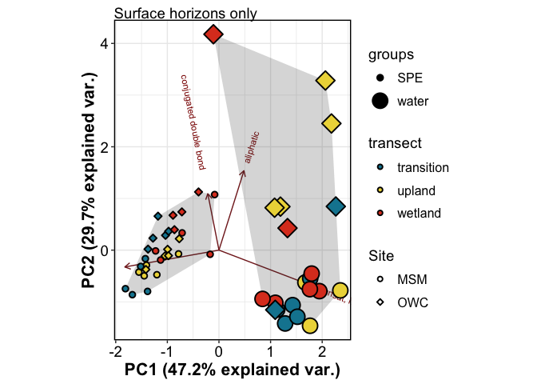<!-- -->

Separation was primarily along SPE vs. WATER extraction types.

    ## [1] "WATER EXTRACTS"

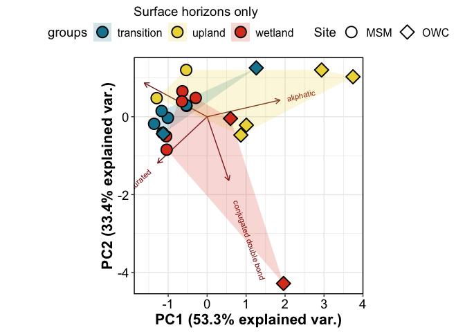<!-- -->

    ## [1] "SPE EXTRACTS"

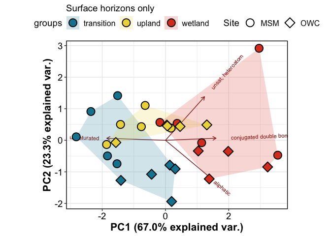<!-- -->

### relative abundance

PLOTTING ALL REPLICATES

    ## [1] "WATER EXTRACTS"

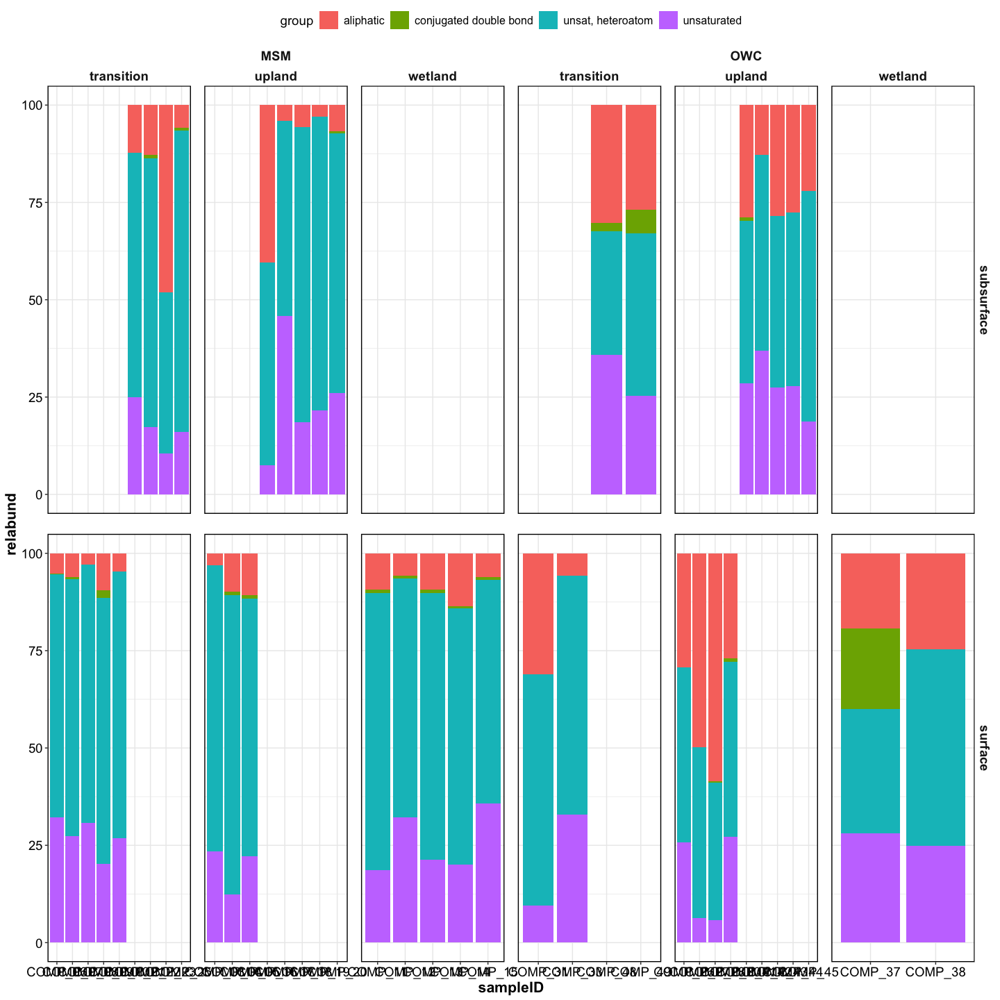<!-- -->

    ## [1] "SPE EXTRACTS"

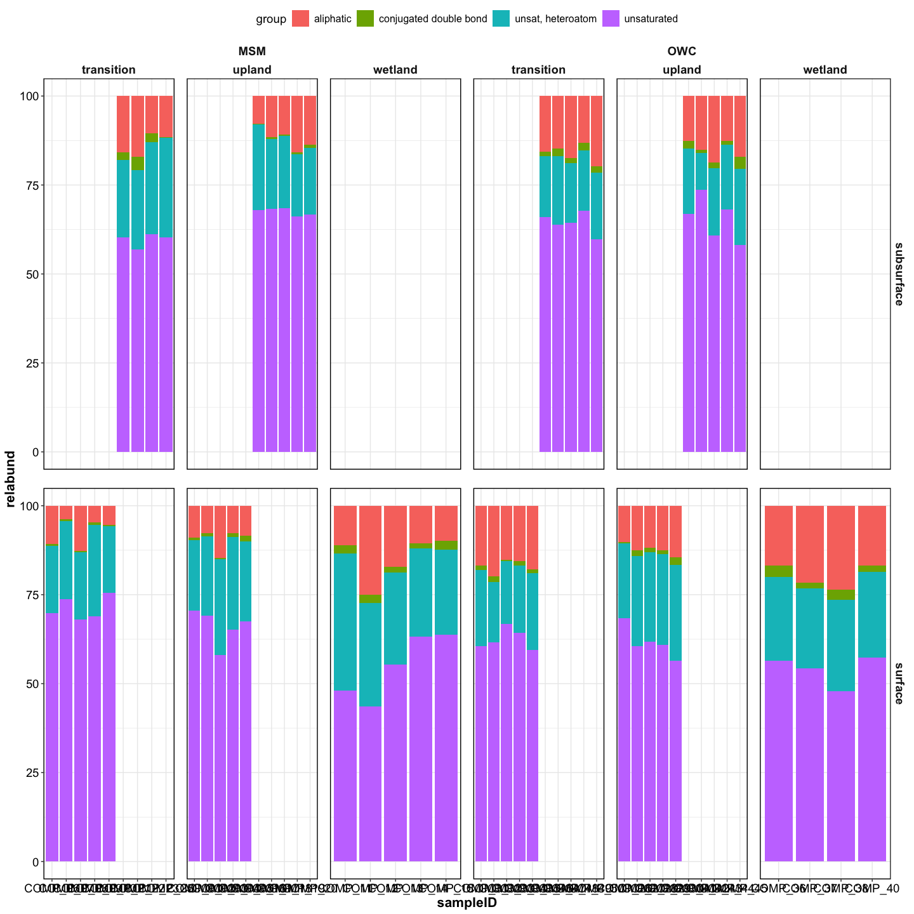<!-- -->

- water extracts more variable. more aliphatic
- SPE extracts less variable. more unsaturated

PLOTTING SUMMARIES

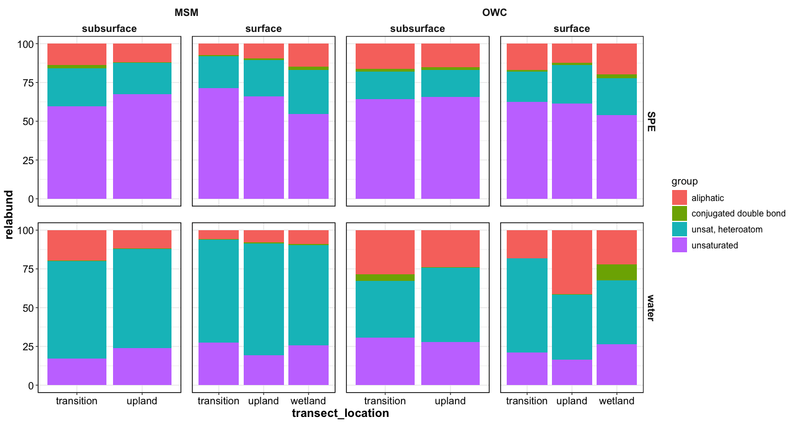<!-- -->

------------------------------------------------------------------------

## Session Info

Session Info

Date run: 2026-03-23

    ## R version 4.5.0 (2025-04-11)
    ## Platform: aarch64-apple-darwin20
    ## Running under: macOS 26.3.2
    ## 
    ## Matrix products: default
    ## BLAS:   /Library/Frameworks/R.framework/Versions/4.5-arm64/Resources/lib/libRblas.0.dylib 
    ## LAPACK: /Library/Frameworks/R.framework/Versions/4.5-arm64/Resources/lib/libRlapack.dylib;  LAPACK version 3.12.1
    ## 
    ## locale:
    ## [1] en_US.UTF-8/en_US.UTF-8/en_US.UTF-8/C/en_US.UTF-8/en_US.UTF-8
    ## 
    ## time zone: America/Los_Angeles
    ## tzcode source: internal
    ## 
    ## attached base packages:
    ## [1] stats     graphics  grDevices utils     datasets  methods   base     
    ## 
    ## other attached packages:
    ##  [1] factoextra_1.0.7    cluster_2.1.8.1     ggh4x_0.3.1        
    ##  [4] whistledown_0.1.0   ggConvexHull_0.1.0  PNWColors_0.1.0    
    ##  [7] ggbiplot_0.55       googlesheets4_1.1.1 vegan_2.7-1        
    ## [10] permute_0.9-7       nmrrr_1.0.0         lubridate_1.9.4    
    ## [13] forcats_1.0.0       stringr_1.5.1       dplyr_1.2.0        
    ## [16] purrr_1.0.4         readr_2.1.5         tidyr_1.3.2        
    ## [19] tibble_3.3.1        ggplot2_4.0.2       tidyverse_2.0.0    
    ## 
    ## loaded via a namespace (and not attached):
    ##  [1] tidyselect_1.2.1   Exact_3.3          rootSolve_1.8.2.4  farver_2.1.2      
    ##  [5] targets_1.11.3     S7_0.2.0           fastmap_1.2.0      janitor_2.2.1     
    ##  [9] digest_0.6.37      base64url_1.4      secretbase_1.0.5   timechange_0.3.0  
    ## [13] lifecycle_1.0.5    processx_3.8.6     lmom_3.2           magrittr_2.0.3    
    ## [17] compiler_4.5.0     rlang_1.1.7        tools_4.5.0        igraph_2.1.4      
    ## [21] yaml_2.3.10        data.table_1.17.0  ggsignif_0.6.4     knitr_1.50        
    ## [25] labeling_0.4.3     prettyunits_1.2.0  plyr_1.8.9         RColorBrewer_1.1-3
    ## [29] abind_1.4-8        expm_1.0-0         withr_3.0.2        grid_4.5.0        
    ## [33] googledrive_2.1.1  ggpubr_0.6.0       e1071_1.7-16       scales_1.4.0      
    ## [37] MASS_7.3-65        cli_3.6.5          mvtnorm_1.3-3      rmarkdown_2.29    
    ## [41] generics_0.1.3     rstudioapi_0.17.1  httr_1.4.7         tzdb_0.5.0        
    ## [45] readxl_1.4.5       gld_2.6.7          proxy_0.4-27       splines_4.5.0     
    ## [49] parallel_4.5.0     cellranger_1.1.0   vctrs_0.7.1        boot_1.3-31       
    ## [53] Matrix_1.7-3       carData_3.0-5      car_3.1-3          callr_3.7.6       
    ## [57] hms_1.1.3          rstatix_0.7.2      ggrepel_0.9.6      Formula_1.2-5     
    ## [61] glue_1.8.0         codetools_0.2-20   ps_1.9.1           cowplot_1.1.3     
    ## [65] stringi_1.8.7      gtable_0.3.6       pillar_1.10.2      htmltools_0.5.8.1 
    ## [69] R6_2.6.1           evaluate_1.0.3     lattice_0.22-6     haven_2.5.4       
    ## [73] backports_1.5.0    broom_1.0.12       snakecase_0.11.1   gargle_1.5.2      
    ## [77] class_7.3-23       DescTools_0.99.60  Rcpp_1.1.1         nlme_3.1-168      
    ## [81] mgcv_1.9-1         xfun_0.53          fs_1.6.6           pkgconfig_2.0.3

